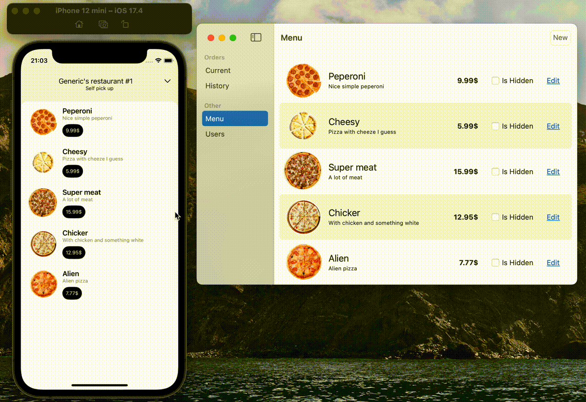

## Generic's Pizza - the most generic pizza place!

> Decisions here are made purely out of curiosity and not practicality

Stuff that I'm using here in no particular order:

- SwiftUI
- Swift
- Vapor
- Postgresql
- Minio
- SotoSwift
- The Composable Architecture
- Bazel

# Customer app

# Restaurant app

