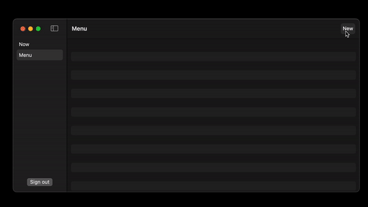

## Generic's Pizza - the most generic pizza place!

> Decisions here are made purely out of curiosity and not practicality

Stuff that I'm using here in no particular order:
- UIKit
- SwiftUI
- Swift (duh)
- Vapor
- Postgresql
- Minio
- SotoSwift
- Github Actions

# Customer app
- [x] Menu
- [x] Making orders and tracking their state
- [ ] Choosing devilery address

# Restaurant app

- [x] Updating orders
- [x] Updating menu
- [ ] Creation and managment of accounts

# Driver app
- [ ] Accepting orders
- [ ] Live location tracking
